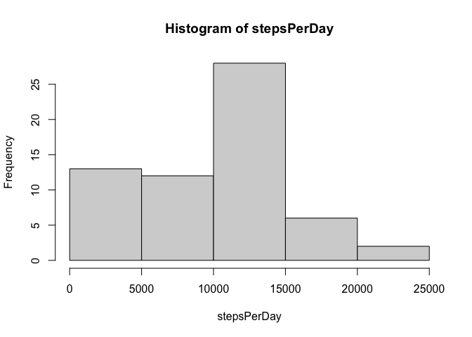
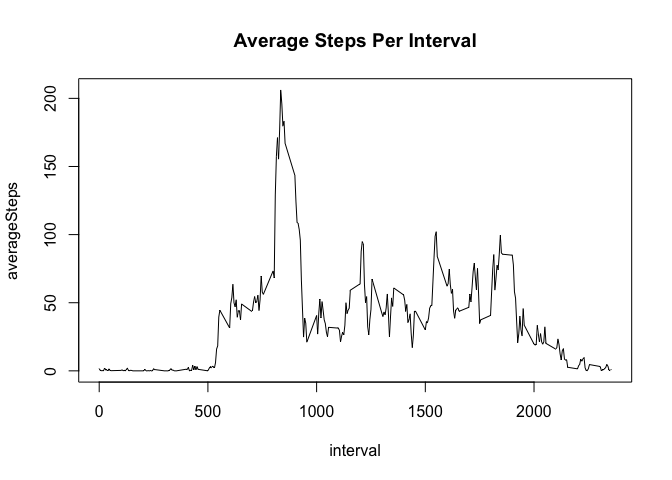
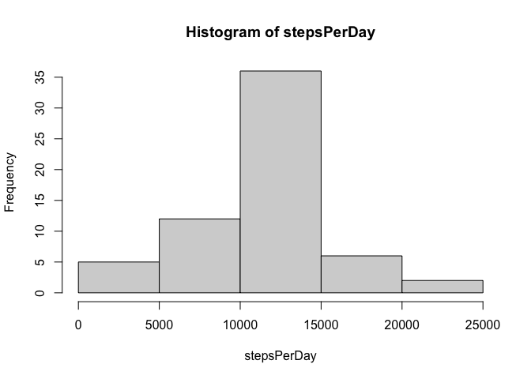
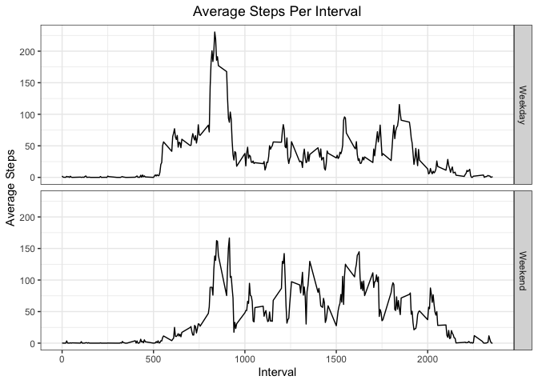

## Setting global options

```r
knitr::opts_chunk$set(message = FALSE)
options(scipen=999)
```
## Downloading dependencies

```r
library(dplyr)
library(ggplot2)
```

## Loading and preprocessing the data

```r
activity <- read.csv("activity.csv")
```


## What is mean total number of steps taken per day?

```r
totalStepsPerDay <- activity %>%
  group_by(date) %>%
  summarize(totalSteps = sum(steps, na.rm = TRUE))
stepsPerDay <- totalStepsPerDay$totalSteps
hist(stepsPerDay)
```

<!-- -->

**Summary statistics for the distribution of total steps taken per day:**

Mean: 9354.2295082

Median: 10395


## What is the average daily activity pattern?

```r
averageStepsPerInterval <- activity %>%
  group_by(interval) %>%
  summarize(averageSteps = mean(steps, na.rm = TRUE))
averageSteps <- averageStepsPerInterval$averageSteps
intervalWithMaxAverage <- averageStepsPerInterval$interval[which.max(averageSteps)]
with(averageStepsPerInterval, plot(
   interval,
   averageSteps,
   type = "l",
   main = "Average Steps Per Interval"
))
```

<!-- -->

The interval with the highest average number of steps is 835


## Imputing missing values
2304 rows have NAs.

For any row with missing steps, the steps were imputed by using the mean steps
for that row's interval.

```r
activity$steps <- apply(activity, 1, function(row) {
  thisInterval <- as.numeric(row[["interval"]])
  if (is.na(row[["steps"]])) {
    averageStepsThisInterval <- with(averageStepsPerInterval,
      averageStepsPerInterval[interval == thisInterval,]$averageSteps
    )
    return(averageStepsThisInterval)
  } else {
    return(row[["steps"]])
  }
})
activity$steps <- as.numeric(activity$steps)

## this is copied from an earlier chunk
totalStepsPerDay <- activity %>%
  group_by(date) %>%
  summarize(totalSteps = sum(steps, na.rm = TRUE))
stepsPerDay <- totalStepsPerDay$totalSteps
hist(stepsPerDay)
```

<!-- -->

**Summary statistics for the distribution of total steps taken per day:**

Mean: 10766.1886792

Median: 10766.1886792

Imputing step counts raised the average and median steps recorded per day.


## Are there differences in activity patterns between weekdays and weekends?

```r
activity$isWeekend <- sapply(as.Date(activity$date), function(dat) {
  if (weekdays(dat) %in% c("Sunday", "Saturday")) {
    return("Weekend")
  } else {
    return("Weekday")
  }
})
  
averageStepsByIntervalAndWeekend <- activity %>%
  group_by(interval, isWeekend) %>%
  summarize(averageSteps = mean(steps))

ggplot(averageStepsByIntervalAndWeekend, aes(interval, averageSteps)) +
  facet_grid(isWeekend ~ .) +
  geom_line() +
  theme_bw() +
  theme(plot.title = element_text(hjust = 0.5)) +
  labs(title = "Average Steps Per Interval") +
  labs(y = "Average Steps", x = "Interval")
```

<!-- -->
